# Chapter_3

[더북(TheBook): 오라클 SQL과 PL/SQL을 다루는 기술](https://thebook.io/006696/)

# — SELECT —

SELECT * 혹은 컬럼
FROM 테이블 또는 VIEW
WHERE 조건
ORDER BY 컬럼;

어디서 가져올꺼니? FROM
무엇을 가져올꺼니? SELECT
어떻게 가져올꺼니? WHERE

- 사원 테이블에서 급여가 5000이 넘는 사원번호와 사원명을 조회
    
    ```sql
    SELECT 
        employee_id
        , emp_name
        , salary
    FROM employees
    WHERE salary > 5000;
    ```
    
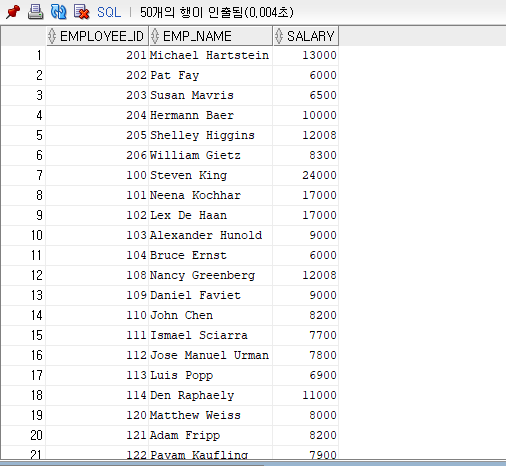
    
- ORDER BY 추가
    
    
    ```sql
    -- ORDER BY 추가
    SELECT 
        employee_id
        , emp_name
        , salary
    FROM employees
    WHERE salary > 5000
    ORDER BY employee_id;
    ```
    
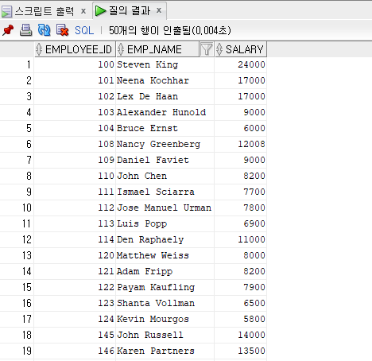
    
- 급여가 5000 이상이고 job_id가 IT_PROG 사원 조회
    
    ```sql
    -- 급여가 5000 이상이고 job_id가 IT_PROG 사원 조회
    SELECT 
        employee_id
        , emp_name
        , salary
        , job_id
    FROM employees
    WHERE salary > 5000
        AND job_id = 'IT_PROG'
    ORDER BY employee_id;
    ```
    
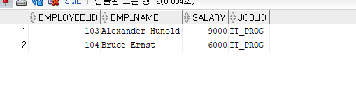
    
- 영어는 대소문자 구분
    
    ```sql
    SELECT 
        employee_id
        , emp_name
        , salary
    FROM employees
    WHERE salary > 5000
        AND job_id = 'it_prog' -- 영어는 대소문자 구분
    ORDER BY employee_id;
    ```
    
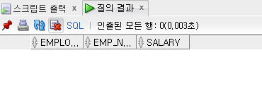
    
- 합집합
    
    ```sql
    -- 급여가 5000 이상이거나 job_id가 'IT_PROG'인 사원 (OR)
    -- 합집합
    SELECT 
        employee_id
        , emp_name
        , salary
        , job_id
    FROM employees
    WHERE salary > 5000
        OR job_id = 'it_prog' -- 영어는 대소문자 구분
    ORDER BY employee_id;
    ```
    
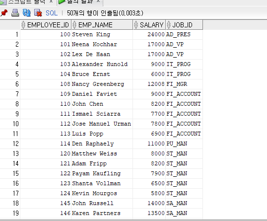
    

# — INSERT —

- CREATE TABLE
    
    ```sql
    -- INSERT 
    CREATE TABLE ex3_1 (
        col1 VARCHAR2(10), 
        col2 NUMBER, 
        col3 DATE
    );
    ```
    
- INSERT
    
    ```sql
    INSERT INTO ex3_1(col1, col2, col3) 
    VALUES ('ABC', 10, SYSDATE);
    ```
    
    ```sql
    -- p.97
    -- 컬럼명 생략
    INSERT INTO ex3_1
    VALUES ('GHI', 10, SYSDATE);
    
    INSERT INTO ex3_1 (col1, col2)
    VALUES('GHI', 20);
    
    ```
    
- "inconsistent datatypes: expected %s got %s” 오류

```sql
-- 타입 맞추지 않음 오류 발생
INSERT INTO ex3_1(col1, col2, col3)
VALUES ('ABC', 10, 30);
```

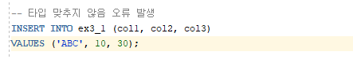

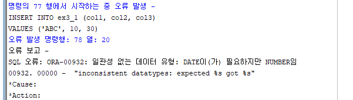

- “not enough values” 오류

```sql
INSERT INTO ex3_1
VALUES ('GHI', 30);
```

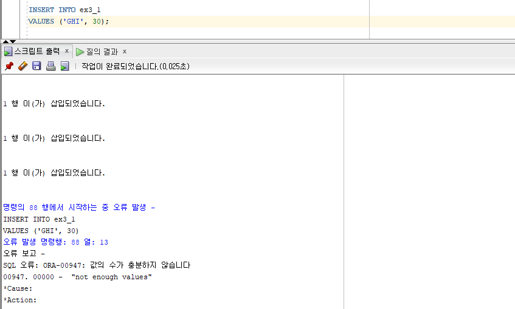

- INSERT ~ SELECT 형태
    
    ```sql
    -- table EX3_2 생성
    CREATE TABLE ex3_2 (
        emp_id       NUMBER
        , emp_name   VARCHAR2(100)
    );
    
    -- 실무에서 많이 쓰임
    INSERT INTO ex3_2(emp_id, emp_name)
    SELECT 
        employee_id
        , emp_name
    FROM employees
    WHERE salary > 5000;
    SELECT * FROM ex3_2;
    ```
    
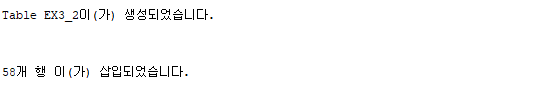
    

# — UPDATE —

- UPDATE
    
    ```sql
    -- UPDATE
    SELECT * 
        FROM ex3_1;
    ```
    
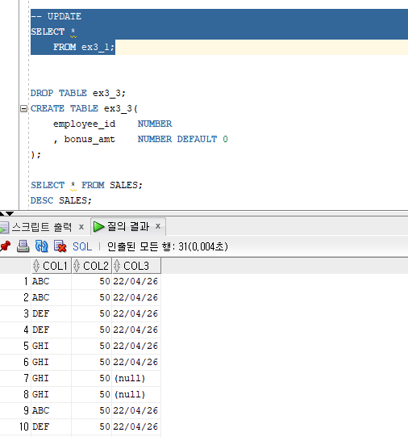
    
- ex3_1 테이블의 col2 값을 모두 50으로 변경
    
    ```sql
    UPDATE ex3_1
        SET col2 = 50;
    ```
    
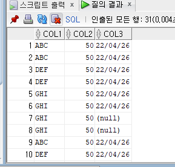
    
- col3 값을 UPDATE
    
    ```sql
    -- UPDATE
    SELECT * 
        FROM ex3_1;
        
    UPDATE ex3_1
        SET col2 = 50;
    
    UPDATE ex3_1
        SET col3 = SYSDATE
        WHERE col3 = '';
    
    UPDATE ex3_1
        SET col3 = SYSDATE
        WHERE col3 IS NULL;
    ```
    

# — MERGE —

- MERGE문은 조건을 비교해서 테이블에 해당 조건에 맞는 데이터가 없으면 INSERT, 있으면 UPDATE를 수행하는 문장이다.

```sql
MERGE INTO [스키마.]테이블명
	USING (update나 insert 될 데이터 원천)
		ON (update될 조건)

```

```sql
MERGE INTO ex3_3 d 
    USING (SELECT
                employee_id
                , salary 
                , manager_id
           FROM employees
           WHERE manager_id = 146) b 
        ON (d.employee_id = b.employee_id)
WHEN MATCHED THEN 
    UPDATE SET d.bonus_amt = d.bonus_amt + b.salary * 0.01 
WHEN NOT MATCHED THEN 
    INSERT (d.employee_id, d.bonus_amt) VALUES (b.employee_id, b.salary * 0.001)
    WHERE (b.salary < 8000);
    
SELECT * FROM ex3_3 ORDER BY employee_id;
```

```sql
MERGE INTO ex3_3 d 
    USING (SELECT
                employee_id
                , salary 
                , manager_id
           FROM employees
           WHERE manager_id = 146) b 
        ON (d.employee_id = b.employee_id)
WHEN MATCHED THEN 
    UPDATE SET d.bonus_amt = d.bonus_amt + b.salary * 0.01
    DELETE WHERE (b.employee_id =161)
WHEN NOT MATCHED THEN 
    INSERT (d.employee_id, d.bonus_amt) VALUES (b.employee_id, b.salary * 0.001)
    WHERE (b.salary < 8000);
    
SELECT * FROM ex3_3 ORDER BY employee_id;
```

# — DELETE —

```sql
DELETE ex3_3;
SELECT * FROM ex3_3;

-- Commit Rollback Truncate
-- Commit 변경한 데이터를 DB에 마지막으로 반영
-- ROLLBACK : 반대로 변경한 데이터를 변경하기 이전 상태로 되돌림
CREATE TABLE ex3_4(
    employee_id NUMBER
);

INSERT INTO ex3_4 VALUES (100);

SELECT * FROM ex3_4;

commit;

rollback;
```

# — TRUNCATE —

```sql
-- TRUNCATE 문
-- 한번 실행 시, 데이터 바로 삭제, ROLLBACK 적용 안됨.
-- DELETE 문은 데이터 삭제 후, COMMIT 필요 / ROLLBACK 데이터가 삭제되기 전으로 돌아감.

SELECT * FROM ex3_4;
TRUNCATE TABLE ex3_4;
```

# — 연산자 —

- 수식 연산자 : +, -, *, /
- 문자 연산자 : ‘ | | ‘  는 두 문자를 붙이는 연산을 수행한다.
- 논리 연산자 : >, <, ≥, ≤, =, <> ≠, ^=
- 집합 연산자 : UNION, UNION ALL, INTERSECT, MINUS
- 계층형 쿼리 연산자 : PRIOR, CONNECT_BY_ROOT

# — 표현식 —

- WHEN THEN

```sql
-- 표현식 (조건문)
-- CASE WHEN 조건 THEN ELSE END

SELECT 
    employee_id
    , salary
    , CASE WHEN salary <= 5000 THEN 'C등급'
           WHEN salary > 5000 AND salary <= 15000 THEN 'B등급'
           ELSE 'A등급'
    END AS salary_grade
FROM employees;
```

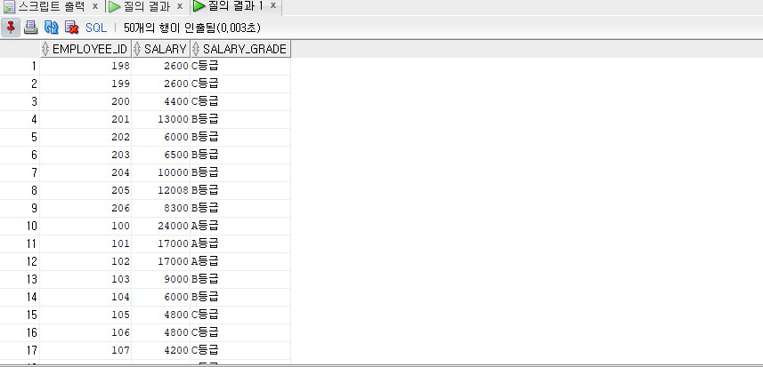

# — 조건식 —

- ANY (or 연산자와 같아서 ANY를 사용 한다.)

```sql
-- ANY
SELECT 
    employee_id
    , salary
FROM employees
WHERE salary = ANY (2000, 3000, 4000);
```

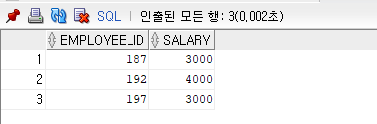

- or

```sql
-- or
SELECT 
    employee_id
    , salary
FROM employees
WHERE salary = 2000 or salary = 3000 or salary = 4000;
```

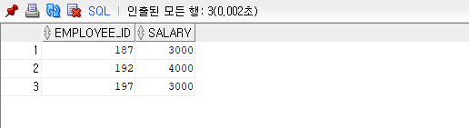

- ALL - 괄호 안의 조건을 모두 만족하는 조건

```sql
-- ALL 
-- 모든 조건을 동시에 만족해야 함

SELECT
    employee_id
    , salary
FROM employees
WHERE salary = ALL(2000, 3000, 4000)
ORDER BY employee_id;
```

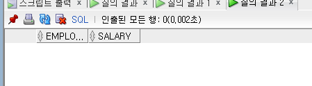

- SOME

```sql
-- SOME
-- salary 2000, 3000, 4000 에 해당하는 것을 조회
SELECT
    employee_id
    , salary
FROM employees
WHERE salary = SOME(2000, 3000, 4000)
ORDER BY employee_id;
```

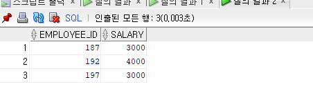

- 논리 조건식

```sql
-- 논리 조건식
-- salary 2500 이상이 아닌 조건을 조회
SELECT
    employee_id
    , salary
FROM employees
-- WHERE salary < 2500
-- WHERE NOT (salary >= 2500)
WHERE NOT salary >= 2500 
ORDER BY employee_id
```

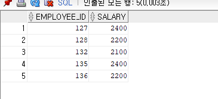

- BETWEEN AND 조건식

```sql
-- BETWEEN AND 조건식
-- 범위 지정
-- 급여가 2000 ~ 2500 사이에 해당하는 사원을 조회해라

SELECT 
    employee_id
    , salary
FROM employees
WHERE salary BETWEEN 2000 AND 2500
ORDER BY employee_id;
```

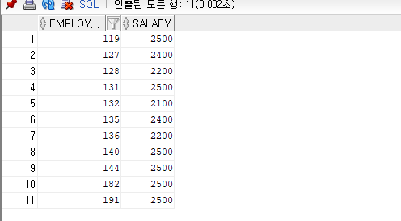

- IN 조건식(IN 은 부등호를 쓰지 않는다.)(ANY 나 SOME은 부등호를 사용.)

```sql
-- IN 조건식 (OR, =ANY)
SELECT
    employee_id
    , salary
FROM employees
WHERE salary IN (2000, 3000, 4000)
ORDER BY employee_id;
```

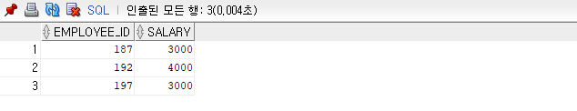

- NOT IN 조건식 (괄호 안의 조건을 제외한 모든것을 조회)

```sql
-- NOT IN 조건식 
SELECT
    employee_id
    , salary
FROM employees
WHERE salary NOT IN (2000, 3000, 4000)
ORDER BY employee_id;

-- <> 
SELECT
    employee_id
    , salary
FROM employees
WHERE salary <>ALL (2000, 3000, 4000)
ORDER BY employee_id;
```

- EXISTS 조건식

```sql
-- EXISTS 조건식
-- IN과 비슷함, 단 서브쿼리 절에서만 사용 가능
SELECT 
    department_id
    , department_name
FROM departments a
WHERE EXISTS (SELECT *
                FROM employees b
                WHERE a.department_id = b.department_id
                AND b.salary > 3000)
ORDER BY a.department_name;
```

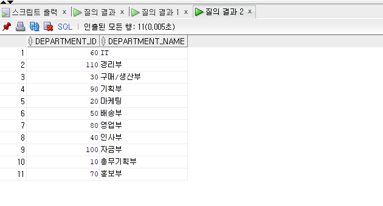

- LIKE  조건식

```sql
-- LIKE 조건식
-- 문자열의 패턴을 검색할 때 사용하는 조건식
-- 사원 테이블 사원 이름이 'A'로 시작되는 사원 조회
SELECT emp_name
FROM employees
WHERE emp_name LIKE 'A%'
ORDER BY emp_name;
```

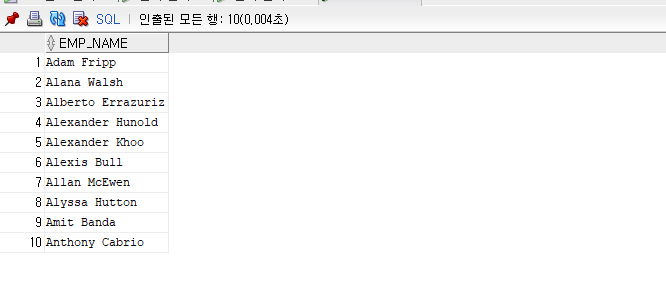

```sql
-- 앞에 어떤 글자가 와도 상관없이 'a'로 끝나는 모두 조회
SELECT emp_name
FROM employees
WHERE emp_name LIKE '%a'
ORDER BY emp_name;
```

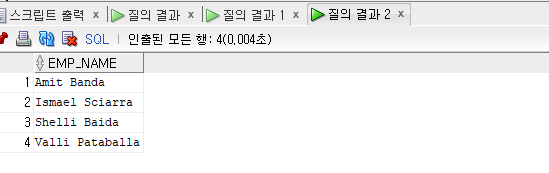

```sql
-- '__c' 세번쨰 글자가 c 인 경우 모두 조회
SELECT emp_name
FROM employees
WHERE emp_name LIKE '__c%'
ORDER BY emp_name;
```

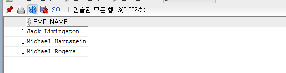

# 핵심 정리

1. 데이터를 조작하는 대표적인 DML문에는 SELECT, INSERT, UPDATE, DELETE, MERGE 가 있다.
2. MERGE문은 INSERT와  UPDATE가 혼합된 형태로, 특정 조건에 따라 INSERT와 UPDATE를 수행한다.
3. 데이터 조작 후에는 트랜잭션 처리를 위해 반드시 COMMIT이나 ROLLBACK을 해야 한다.
4. DML, DDL문 외에도 SQL 문장은 의사컬럼, 연산자, 표현식, 조건식으로 구성된다.
5. 연산자는 다양한 연산을 수행하며, 수식, 문자, 논리, 집합, 계층형 쿼리 연산자가 있다.
6. 조건식은 하나 이상의 표현식과 논리 연산자가 결합된 식으로 TRUE, FALSE, UNKNOWN 세 가지 타입을 반환하며, 비교, 논리, NULL, BETWEEN, IN, EXISTS 조건식이 있다.